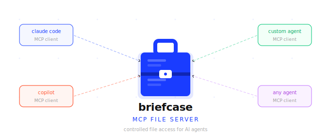

# The Briefcase

An MCP server that gives AI agents controlled access to files outside their working directory.

## What is The Briefcase?

  

AI agents — such as Claude Code, GitHub Copilot, or any MCP-compatible client — typically only see files inside their current working directory. The Briefcase solves this by acting as a secure file courier: it exposes a curated set of directories to agents through a structured API, without ever revealing the underlying file origins.

You configure which directories to share. The Briefcase assigns each file a stable ID (a GUID). Agents work entirely through those IDs — they never see real paths, cannot traverse the directory tree, and cannot access anything outside what you explicitly shared.


## Video Demo

[](https://youtu.be/29OXo1NEDLc)

## How It Works

```
  Your file system          The Briefcase MCP Server          AI Agent
  ──────────────           ───────────────────────────       ─────────
  C:\docs\notes.txt  ───►  briefcase://file/{guid}  ───►   list_files
  C:\docs\report.md  ───►  briefcase://file/{guid}  ───►   read_file
  D:\shared\data.csv ───►  briefcase://file/{guid}  ───►   (notifications)
                           briefcase://file/{guid}  ◄───   create_file / update_file
```

1. You tell The Briefcase which directories to watch via the `BRIEFCASE_PATHS` environment variable.
2. On startup, it scans those directories recursively and assigns each file a stable GUID.
3. The GUID-to-path mapping is saved to `registry.json` so IDs survive server restarts — agents can hold onto a file's ID indefinitely.
4. Agents call `list_files` to discover what's available and `read_file` to retrieve content.
5. When files change on disk, The Briefcase sends MCP notifications so agents can react in real time.

## Status

Version 1.2 — Prototype. Local file system only.

## Setup

- [Windows](docs/setup-windows.md)
- [macOS](docs/setup-macos.md)

## Available Tools

See [Tools Reference](docs/tools.md) for full parameter and return-value details.

**File Tools**
- `list_files` — discover all files known to The Briefcase; supports filtering by project and sort order
- `read_file` — retrieve a file's content by its GUID
- `create_file` — write a new file into The Briefcase
- `update_file` — replace the full content of an existing file
- `search_files` — search files by name, content, or both

**Project Tools**
- `create_project` — create a named group for organizing files
- `list_projects` — list all projects with file counts
- `get_project` — get a project's metadata and its file list
- `add_file_to_project` — associate a file with a project
- `remove_file_from_project` — remove a file from a project
- `update_project` — rename or re-describe a project
- `delete_project` — delete a project (files remain in The Briefcase)
- `reindex_files` — rebuild the file registry and search cache

**File Change Notifications**

The Briefcase watches configured directories in real time and sends standard MCP resource notifications when files are created, deleted, renamed, or modified. See [Tools Reference](docs/tools.md#file-change-notifications) for details.

## Roadmap

- [x] Search files by name and content
- [x] Create file
- [x] Update file content
- [x] Projects — group files and filter by project
- [ ] Cloud storage backends (e.g. OneDrive, Google Drive)
- [ ] File locking and edit conflict resolution
- [ ] HTTP with Server-Sent Events

## License

Copyright 2026 Matthew Raffel. Licensed under the [Apache License 2.0](LICENSE).

## File Version
1.2.0
